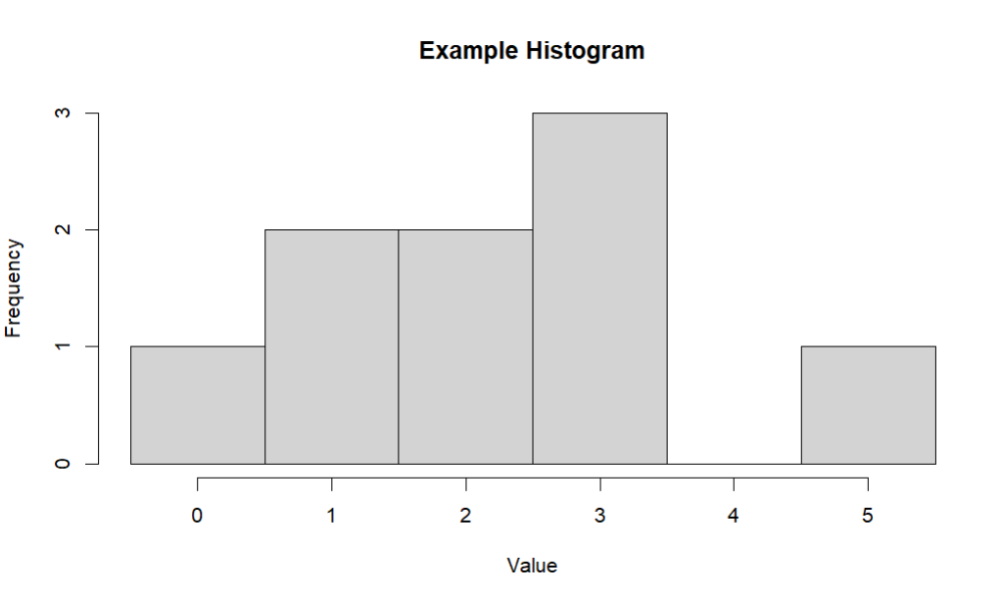

# 1933 Lab 3: Recursive/Iterative Methods, & Arrays

Buckle up! This lab can be a bit long. Let's begin by pulling the Lab 3 repo from GitHub. In the terminal, navigate to the top of the `CSCI-1933-Student-Code` directory using the `cd` command. Then, run this command:

```bash
git pull
```

You should find these files:

- Fib.java
- Histogram.java
- HistogramApp.java
- MaxDigit.java

This lab has four Milestones, but you can think of it as two halves. The first is using both recursive and iterative approaches to solve the same problem, and the second is using the Scanner class along with arrays to create a visualization of histograms.

## Iteration, Recursive Iterative, and Recursion
There are three main ways in which we can repeat the execution of lines of code while programming:

* **Iteration:** The use of a `for` or `while` loop to repeat blocks of code is iteration. There is an example of iteration below.
```Java
public static int factorialI(int n) {
        if (n < 0) {
            return -1; // Case: Bad input
        }
        int result = 1;
        for (int i = 1; i <= n; i++) { // Loop until correct factorial created.
            result *= i;
        }
        return result;
    }
```

* **Tail Recursion:** In a tail recursive approach, the recursive call is the last operation in the method. This process can emualte iterative approaches, and the "problem" does **NOT** become smaller after each recursive call. The function parameters in a tail recursive solution often have a counter (or accumulator) parameter that keeps track of the total number of iterations or otherwise "accumulates" the solution. Like a `for` loop! In the example below, notice how the helper method contains a `counter` variable that is returned when the base case is reached.
```Java
public static int factorialRI(int n) {
        if (n < 0)
            return -1; // Case: Bad input
        else
            return factorialHelper(n, 1); // Call helper method (counter set to 1)
    }
    private static int factorialHelper(int n, int counter) {
        if (n == 0) { // Case: Base Case
            return counter;
        }
        return factorialHelper(n - 1, n * counter); // Case: Recursive Case
    }
```

* **Recursion:** When a function calls itself **To make the problem SMALLER** it is recursive. For example, a factorial function would be recursive, as each recursive call makes `n` smaller. There is an example below.
```Java
// Recursive Factorial
public static int factorialR(int n) {
        if (n < 0) {
            return -1; // Case: Bad input
        }
        if (n == 0 || n == 1) { // Case: Base Case
            return 1;
        }
        return n * factorialR(n - 1); // Case: Recursive Case
    }
```


## Milestone 1

The Fibonacci sequence is named after the Italian mathematician Leonardo of Pisa, also known as Fibonacci. The steps for the Fibonacci sequence are to start with the 0th and 1st terms, which are 0 and 1 respectively, and to calculate the next term, sum the previous two terms. Using the initial numbers 0 + 1 = 1 the 2nd term in the Fibonacci sequence is 1. Now that you know the pattern, here are the 0th through 8th numbers in the Fibonacci sequence: 0, 1, 1, 2, 3, 5, 8, 13, 21. You will likely find that the recursive approach is more intuitive.

In the Fib.java file, complete the following methods:

- fibonacciRecursive() - returns the nth Fibonacci number as an int using a **recursive** approach
- fibonacciIterative() - returns the nth Fibonacci number as an int using an **iterative** approach

Some test cases (for any given input, both methods should return the same value):

- fibonacciRecursive(3) returns 2
- fibonacciRecursive(8) returns 21
- fibonacciIterative(5) returns 5
- fibonacciIterative(10) returns 55

Once these two methods work, use the Scanner class in the main method of Fib to prompt the user for input. The Scan.java file  gives a more in-depth example of taking integers as input. Here is an example of a main method you could have:

```Java
public static void main(String[] args) {
    // Instantiate Scanner
    Scanner s = new Scanner(System.in);
    // Prompt user
    System.out.println("Enter an int n to get the nth Fibonacci number: ");
    // Gets integer from the command line
    int n = s.nextInt();
    // Print the results
    System.out.println("The " + n + "'th Fibonacci number using fibonacciRecursive is " + fibonacciRecursive(n));
    System.out.println("The " + n + "'th Fibonacci number using fibonacciIterative is " + fibonacciIterative(n));
}
```

### Reflection

When you run your method with large values like 80 or 200 what happens? Are there redundant calculations that are slowing down your method? How might you speed up your method by using an array, and how do your recursive and iterative approaches compare? (This is not a coding question, but rather something to think about).

### Milestone 1 Checkoff

Show a TA your methods, run your main method, let them test some numbers to show it works correctly, and answer this question: How does your Fibonacci method handle a negative value for the input **n**?

## Milestone 2

Let's use recursive and iterative processes to solve a different problem. For this Milestone, given a **positive** integer, you will find the maximum digit. You'll likely find the iterative approach more intuitive.

In the MaxDigit.java file, complete the following methods:

- iterativeMaxDigit() - returns the maximum digit in an integer iteratively
- recursiveMaxDigit() - returns the maximum digit in an integer recursively

Some test cases (for any given input, both methods should return the same value):

- iterativeMaxDigit(578) returns 8
- iterativeMaxDigit(10) returns 1
- recursiveMaxDigit(9999) returns 9
- recursiveMaxDigit(13442) returns 4

**HINT**: Use integer division `'/'` and the modulo `'%'` (the remainder) to separate the individual digits. For example, 1637/10 = 163 and 1637%10 = 7 using Java logic.

### Milestone 2 Checkoff

Write a main method like the one for Milestone 1. Show a TA your methods, run your main method, and let them test some numbers to show it works correctly.

## Milestone 3

### Histogram

Recall, a histogram, also known as a bar graph, is a visual representation of a distribution of discrete data. For example, the data set {3, 2, 1, 2, 3, 0, 1, 5, 3} over the range of [0, 5] will have a histogram that might look like this:



For this lab, we will be printing our histogram in the console. It will look something like this:

<a name="hist"></a>

```plaintext
0: *
1: **
2: **
3: ***
4:
5: *
```

You will be storing the histogram data in an array. These are *similar* to Python lists with key differences.

- Arrays are of **fixed** size, which cannot be changed after they're created.
- Arrays can only hold elements of the **same** data type

An array essentially has two components: its **index**, the order it appears in the array (starting at 0), and its **value**, the mutable piece of data that corresponds to each index. For your histogram, **the value is the frequency of the corresponding number in the data set**.

It's good programming practice to break your problems down into smaller pieces. You should be working in the Histogram.java file.

1. Complete the constructor
2. Complete the add() method
3. Complete the toString()
4. Complete the main method

### Complete the Constructor

The constructor's signature looks like this: `public Histogram(int lowerbound, int upperbound)`.

Recall, that you need to initialize your instance variables here (lower, upper, hist). Initializing the first two, which are two integers, should be nothing new. If the upper bound passed in is less than the lower bound, just swap them! Here is how you would initialize the array:

```Java
hist = new int[size] // replace size with the size of the array
```

How can you figure out the size to make your array? In the example above, the upper bound is 5, the lower bound is 0, and the size should be 6. How can you generalize this for any lower and upper bound?

### Complete the add() Method

Method signature: `public boolean add(int n)`.

If n is between the lower bound (lower) and upper bound (upper) inclusive, add n to the histogram array (by incrementing the value at the appropriate index) and return true. Otherwise, return false.

If you're trying to increase the frequency of a number n in the histogram array, you need to subtract n by the lower bound to get the correct index of the value you should modify.

For example, if lower = 5, upper = 10, and n = 6, you can add 6 to the histogram like this:

```Java
hist[n - lower]++;
```

### Complete the toString()

toString() is a method that gives a string representation of an object. If you try this:

```Java
Histogram h1 = new Histogram(5, 10);
System.out.println(h1);
```

It should print out some nonsense like *Histogram@0x7FAB2D* — the default toString() for objects. We write toString() methods to give a more appropriate representation of an object.

A toString() returns a String, and this means **you are not printing anything in this method**. It should return a String that looks like [THIS](#hist). Use the character '\n' to add newlines to your String.

### Complete the main Method

Implement some tests on an instance of Histogram to confirm that everything is working correctly. For instance, code would create the histogram in the example histogram. In your main method, test it with a lower bound that isn't 0, and add at least 10 numbers to your Histogram.

```Java
public static void main(String[] args) {
        Histogram h = new Histogram(0, 5);
        h.add(3);
        h.add(2);
        h.add(1);
        h.add(2);
        h.add(3);
        h.add(0);
        h.add(1);
        h.add(5);
        h.add(3);
        System.out.println(h);
}
```

### Milestone 3 Checkoff

Show a TA your Histogram class code and your main method, that adds at least 10 numbers to a Histogram and prints it out.

## Milestone 4

### HistogramApp

Now, you're going to work on a new class called HistogramApp (in the HistogramApp.java file). You will use the Scanner class to take user input to make your Histogram class more interactive.

In your main method:

1. Prompt the user to enter a lower bound and upper bound for their histogram.
2. Create a new instance of Histogram using this lower bound and upper bound.
3. Ask for user input until the program ends. Use a **while** loop to accomplish this. Implement the following commands (i.e. what should be done when the user types in this String):

- "add": Prompt the user to enter a number to add to the Histogram. To do this, use a Scanner object to take in the user's input, and call the add() method on your Histogram instance.
- "print": Give the user a view of their Histogram by printing it out. You can call `System.out.println()` on the Histogram instance, but your toString() method must work properly. You don't need to explicitly use the toString() — `System.out.println()` will do it for you.
- "quit" - Calling this should end your program.
- ONLY take those three commands. If a user types something else in, remind them of their options. Here is a sample output:

>-------- Histogram Console --------
Options:
add - add a number to the histogram
print - print histogram to the console
quit - leave the program
>
> Enter a lower bound:
> *10*
>
> Enter an upper bound:
> *13*
>
> Choose an option:
> *add*
>
> Enter a number to add:
> *10*
>
> Choose an option:
> *add*
>
> Enter a number to add:
> *12*
>
> Choose an option:
> *add*
>
> Enter a number to add:
> *20*
>
> 20 is not in the range
>
> Choose an option:
> *no*
>
> Not a valid option. You can "add", "print", or "quit".
>
> Choose an option:
> *print*
> 10: *
> 11:
> 12: *
> 13:
>
> Choose an option:
> *quit*
> Goodbye!

### Milestone 4 Checkoff

> Show a TA your HistogramApp and let them test it out!
